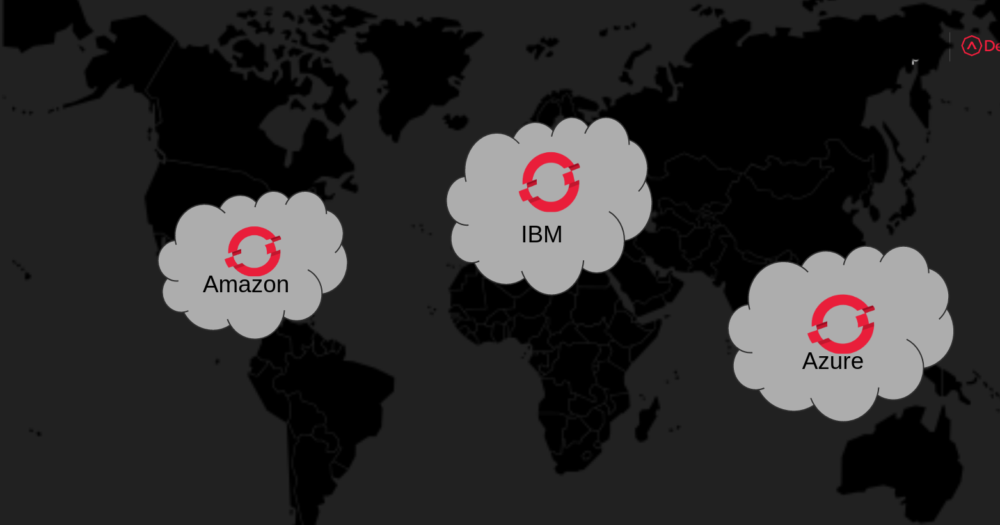
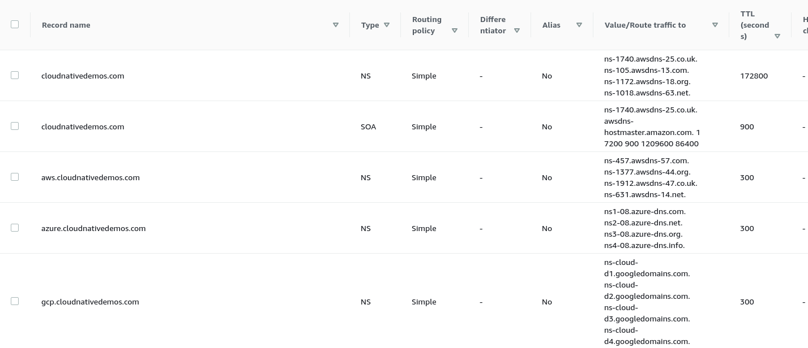

= Install OpenShift clusters on Public Clouds

Use IPI installation mode to create a 3 master 2 worker nodes cluster for the hybrid cloud demo

== Quotas & Prerequisites

By default mostly all public clouds limit resources for new users, ensure you met all requirements you find in the documentation for your cloud provider.

NOTE: Quota is always *per region*, ask to increase the quota for your region.

=== AWS (US)

With this topology (3+2) default quota you should be fine with this `install-config.yaml`.

The default region for this demo (that you can change from `install-config.yaml`) is:

- *us-east-1*

If you want a default cluster of 3+3, check out link:https://docs.openshift.com/container-platform/latest/installing/installing_aws/installing-aws-account.html#installation-aws-limits_installing-aws-account[Service limits] to review all limits.

Min. Quota:

* *EC2 Instances / Instance Limit (All Standard (A, C, D, H, I, M, R, T, Z) instances)*:  20

=== GCP (Europe)

The default region for this demo (that you can change from `install-config.yaml`) is:

- *europe-west3*

You need to ensure all link:https://docs.openshift.com/container-platform/latest/installing/installing_gcp/installing-gcp-account.html#installation-gcp-project_installing-gcp-account[requirements] are met for Google Cloud.

Min. Quota:

* *N2_CPUS*: 24
* *SSD_TOTAL_GB*: 1000

=== Azure (Asia)

The default region for this demo (that you can change from `install-config.yaml`) is:

- *southeastasia*

You need to ensure all link:https://docs.openshift.com/container-platform/latest/installing/installing_azure/installing-azure-account.html[requirements] are met for Azure.

Min. Quota:

* *DSv3 Series*: 40

== Download installer

Go to https://cloud.redhat.com/openshift/install to get the Installer and the Pull Secret for your cluster.

Add the pull secret and your ssh public key to your `install-config.yaml` inside `aws,gcp,azure` dir, follow link:https://docs.openshift.com/container-platform/latest/welcome/index.html[Documentation] for all details for the installation on the specific cloud provider.

=== Change basedomain

Use your own domain for the clusters, change it from `baseDomain:` inside `install-config.yaml`.

In this example, I have one domain `cloudnativedemos.com` managed by link:https://aws.amazon.com/route53/[Route53] as Hosted Zone, and one additional Hosted zone for the subdomain on AWS `aws.cloudnativedemos.com`. You can then create the DNS in Google Cloud DNS and Azure DNS and use `NS` servers as shown:

=== AWS

[source,bash, role="copypaste"]
----
openshift-install create cluster --dir=aws --log-level=debug
----

=== GCP

[source,bash, role="copypaste"]
----
openshift-install create cluster --dir=gcp --log-level=debug
----

=== Azure

[source,bash, role="copypaste"]
----
openshift-install create cluster --dir=azure --log-level=debug
----

